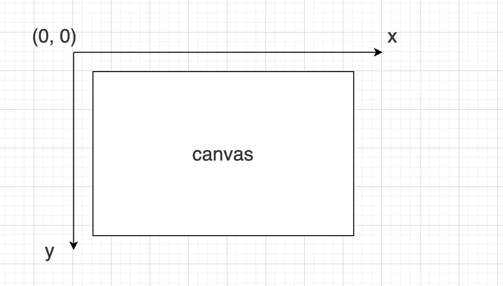

# Canvas 功能梳理

在我们的项目里，Canvas 已经被用在不少场景中：

- 二创视频：头像合成
- 多人角色：多人角色头像裁切、合成
- 自定义语音：音频频谱动画

这篇文章想做一件事：把 Canvas 的功能体系系统梳理一遍，从基础 API 到动画、交互，再到图像处理和常见封装库。

## Canvas vs DOM

Canvas 是一块可以自由绘制像素的画布，提供了比 DOM 更底层的绘制能力。

| 特性 | DOM | Canvas |
| --- | --- | --- |
| 渲染对象 | 浏览器管理的节点树 | 像素缓冲区 |
| 布局 | 自动计算 | 手动绘制 |
| 交互 | 事件自动绑定 | 需要自己实现命中检测 |
| 灵活性 | 适合高级 UI、布局 | 适合自定义绘制、动画、特效 |

## 一、Hello Canvas：初识绘制世界

理解 Canvas 绘制的第一步，就是先认识它的坐标系统。

画布默认以左上角为原点，`x` 轴向右递增，`y` 轴向下递增。

我们从最简单的例子开始：绘制一段文字。

```js
const canvas = document.getElementById("canvas");
const ctx = canvas.getContext("2d");

function drawFont() {
  ctx.font = "36px 'Segoe UI'";
  ctx.fillText("Hello Canvas!", 160, 150);
}

drawFont();
```

这就是 Canvas 最基本的绘图流程：

- 获取 `canvas` 上下文
- 指定样式
- 指定坐标
- 绘制内容

示例：[hello canvas](https://mhhong.com/canvasFuction?demo=hello)

## 二、清晰度问题：为什么 Canvas 会模糊

上面的绘图看起来比较模糊，通常和两个因素有关：

- Canvas 的尺寸设置
- 设备像素比 `devicePixelRatio`

### 1. Canvas 有两个尺寸

Canvas 实际上有两套尺寸：

- 内部绘图区域尺寸：由 HTML 属性 `width` / `height` 定义，默认是 `300 * 150`
- 渲染尺寸：由 CSS 尺寸 `style.width` / `style.height` 定义，决定页面上显示的大小

```css
#canvas {
  border: 1px solid #ccc;
  background: #fff;
  margin-top: 20px;
  /* width: 900px;
  height: 600px; */
}
```

```html
<canvas id="canvas" width="600" height="400"></canvas>
```

如果 HTML 尺寸和 CSS 尺寸不一致，浏览器就会对图像进行拉伸或压缩，从而导致模糊。

### 2. 1:1 还不够清晰的原因

即使把这两个尺寸设置一致，有时候看起来还是不够清晰。原因通常是设备像素比。

设备像素比的定义是：

> 设备像素比 = 物理像素 / CSS 像素

其中：

- 物理像素：屏幕上的实际硬件像素点
- CSS 像素：网页布局中的逻辑尺寸

现在的高清屏设备上，这个值通常会大于 `1`。例如：

```js
window.devicePixelRatio === 2;
```

这意味着一个 CSS 像素会对应 2 个物理像素。  
如果页面上显示的是 `600 x 400` 的区域，想要真正清晰，底层往往需要用 `1200 x 800` 的像素去绘制。

### 3. 解决方案：按 DPR 放大画布

解决模糊的核心思路是：把 Canvas 的内部像素按设备像素比放大，再把绘图上下文缩放回来。

```js
function scaleCanvas() {
  const dpr = window.devicePixelRatio || 1;

  // 设置实际像素大小（物理像素）
  canvas.width = LOGICAL_WIDTH * dpr;
  canvas.height = LOGICAL_HEIGHT * dpr;

  // 保持 CSS 尺寸（逻辑像素）
  canvas.style.width = LOGICAL_WIDTH + "px";
  canvas.style.height = LOGICAL_HEIGHT + "px";

  // 缩放绘图上下文，让逻辑像素继续对应 CSS 像素
  ctx.scale(dpr, dpr);
}
```

缩放之后，文字和线条通常会明显更清晰。

## 三、基础 API：路径、样式与绘制

介绍完坐标和尺寸后，就可以开始正式画图了。Canvas 的基础 API 可以大致分成三类：

1. 定义路径
2. 设置样式
3. 执行绘制

### 1. 定义路径

第一步是定义形状。直线、矩形、圆、椭圆、多边形，本质上都可以通过路径描述出来。

需要注意的是：定义路径不等于已经渲染到画布上，真正显示出来还要调用后续的绘制方法。

| 方法 / 属性 | 作用 | 参数说明 |
| --- | --- | --- |
| `ctx.beginPath()` | 开始一条新路径 | 无 |
| `ctx.closePath()` | 闭合当前路径 | 无 |
| `ctx.moveTo(x, y)` | 移动到指定坐标，不画线 | `x, y` |
| `ctx.lineTo(x, y)` | 从当前位置绘制一条直线到指定坐标 | `x, y` |
| `ctx.rect(x, y, w, h)` | 绘制矩形路径 | `x, y, width, height` |
| `ctx.arc(x, y, r, startAngle, endAngle, anticlockwise)` | 绘制圆弧 | `x, y` 圆心，`r` 半径，起止弧度 |
| `ctx.arcTo(x1, y1, x2, y2, r)` | 绘制带圆角的线 | 两点 `x1, y1, x2, y2` 与半径 `r` |
| `ctx.ellipse(x, y, rx, ry, rotation, startAngle, endAngle, anticlockwise)` | 绘制椭圆 | 圆心、半径、旋转角、起止弧度 |
| `ctx.bezierCurveTo(cp1x, cp1y, cp2x, cp2y, x, y)` | 三次贝塞尔曲线 | 两个控制点 + 终点 |
| `ctx.quadraticCurveTo(cpx, cpy, x, y)` | 二次贝塞尔曲线 | 一个控制点 + 终点 |

### 2. 设置样式

第二步是设置样式，主要包括描边、填充、线条和文字样式。

| 属性 | 作用 | 参数说明 |
| --- | --- | --- |
| `ctx.fillStyle` | 填充颜色或渐变 | 颜色字符串、`CanvasGradient`、`CanvasPattern` |
| `ctx.strokeStyle` | 描边颜色或渐变 | 同上 |
| `ctx.lineWidth` | 线条宽度 | 数值 |
| `ctx.lineCap` | 线条末端样式 | `'butt'`、`'round'`、`'square'` |
| `ctx.lineJoin` | 线条交点样式 | `'bevel'`、`'round'`、`'miter'` |
| `ctx.miterLimit` | `miter` 连接最大斜接限制 | 数值 |
| `ctx.globalAlpha` | 全局透明度 | `0 ~ 1` |
| `ctx.setLineDash([segments])` | 设置虚线 | 数组，如 `[5, 3]` |
| `ctx.lineDashOffset` | 虚线偏移 | 数值 |
| `ctx.font` | 字体 | CSS 字符串，如 `'16px sans-serif'` |
| `ctx.textAlign` | 文字水平对齐 | `'left'`、`'center'`、`'right'`、`'start'`、`'end'` |
| `ctx.textBaseline` | 文字垂直对齐 | `'top'`、`'middle'`、`'bottom'`、`'alphabetic'`、`'hanging'` |

### 3. 执行绘制

第三步才是真正把路径、矩形或文字绘制出来。

| 方法 / 属性 | 作用 | 参数说明 |
| --- | --- | --- |
| `ctx.stroke()` | 描边 | 使用当前 `strokeStyle`、`lineWidth` 等 |
| `ctx.fill()` | 填充 | 使用当前 `fillStyle` |
| `ctx.clearRect(x, y, w, h)` | 清空矩形区域 | `x, y, w, h` |
| `ctx.fillRect(x, y, w, h)` | 绘制填充矩形 | `x, y, w, h` |
| `ctx.strokeRect(x, y, w, h)` | 绘制描边矩形 | `x, y, w, h` |
| `ctx.fillText(text, x, y, maxWidth?)` | 绘制填充文字 | 文本、坐标、可选最大宽度 |
| `ctx.strokeText(text, x, y, maxWidth?)` | 绘制描边文字 | 同上 |
| `ctx.measureText(text)` | 测量文字宽度 | 返回对象，如 `{ width }` |

### 案例

- 三角形
- 圆
- 风车
- 随机树

相关示例：

- `[基础API](https://mhhong.com/canvasFuction?demo=basic)`
- `[风车-图形组合](https://mhhong.com/canvasFuction?demo=windmill-composite)`
- `[随机树](https://mhhong.com/canvasFuction?demo=random-tree)`

当掌握了基本形状之后，就可以把简单图形组合出更复杂的场景。

## 四、坐标变换与上下文栈

在复杂绘图中，我们经常需要移动、旋转或缩放坐标系。Canvas 提供了一组非常重要的变换方法。

### 1. 坐标变换

| 方法 | 功能说明 | 举例说明 |
| --- | --- | --- |
| `translate(x, y)` | 平移坐标原点 | 将原点移动到 `(x, y)` |
| `rotate(angle)` | 旋转坐标系 | 绕原点旋转指定角度，单位是弧度 |
| `scale(x, y)` | 缩放坐标系 | 沿 `x`、`y` 方向分别缩放 |
| `transform(a, b, c, d, e, f)` | 直接乘以一个矩阵 | 用于复合变换，不覆盖当前变换 |
| `setTransform(a, b, c, d, e, f)` | 重置并设置新矩阵 | 会清除现有变换 |
| `resetTransform()` | 重置为默认状态 | 相当于清空所有变换 |
| `getTransform()` | 获取当前矩阵 | 返回 `DOMMatrix`，可用于保存或逆变换 |

### 2. 上下文栈

由于这些变换会全局生效，Canvas 还提供了状态管理机制，也就是上下文栈：

| 方法 | 功能 |
| --- | --- |
| `save()` | 保存当前状态，包括样式、坐标等 |
| `restore()` | 恢复上一次保存的状态 |

Canvas 上下文保存的不只是坐标信息，还包括：

- 当前路径
- 样式设置，例如 `fillStyle`、`strokeStyle`、`lineWidth`
- 全局透明度，例如 `globalAlpha`
- 裁剪区域等状态

我们可以利用坐标变换和上下文栈，重新实现风车这样的示例。

相关示例：`[风车 - 坐标变换](https://mhhong.com/canvasFuction?demo=windmill-transform)`

## 五、交互：从静态到响应

Canvas 的一个重要特点是：它擅长绘制，但不天然具备 DOM 那种现成的交互模型。

### 1. Canvas 交互和 DOM 交互的区别

| 特性 | DOM 交互 | Canvas 交互 |
| --- | --- | --- |
| 事件目标 | 每个 DOM 元素都是独立事件目标 | 整个 `<canvas>` 才是事件目标 |
| 命中检测 | 浏览器自动判断点击到了哪个元素 | 需要手动计算是否命中图形 |
| 事件传播 | 支持冒泡和捕获 | 所有事件都落在 `<canvas>` 上 |
| 结构信息 | 元素有层级、有属性 | Canvas 只是像素平面，没有结构信息 |
| 更新方式 | 浏览器自动重绘对应节点 | 修改后通常需要手动清空并重绘 |

### 2. 全量重绘会有性能问题吗

很多人第一次接触 Canvas 时会担心：每次都要整块重绘，会不会很慢？

通常来说，这是 Canvas 的正常工作方式。

1. 立即模式绘制  
Canvas 是像素平面，绘制操作直接作用于位图，不维护节点树和层级结构，所以全量重绘本身就是常态。

2. 浏览器和底层优化  
Canvas 绘制通常由浏览器底层或 GPU 处理，不涉及 DOM 重排、样式计算和合成层管理，因此在很多动画或自定义绘制场景下性能反而很好。

### 3. 绘图与拖拽

我们可以通过一个绘图和拖拽的 demo，更直观地理解交互流程。

相关示例：`[canvas事件](https://mhhong.com/canvasFuction?demo=draw-drag)`

可以拆成两个阶段：

1. 绘图
2. 拖拽

这样就能实现一个初级的画板。

### 4. 签名板

相关示例：`[canvas签名板](https://mhhong.com/canvasFuction?demo=signature)`

签名板是一个很典型的 Canvas 交互场景：监听鼠标或手指移动，把轨迹实时绘制到画布上。

## 六、动画

上面讲的基本都是静态绘制，接下来看看如何在 Canvas 上实现动画。

### 1. 一般思路

Canvas 动画的核心思路其实很统一：每一帧都重新绘制。

1. 清空画布  
使用 `ctx.clearRect(0, 0, width, height)` 或其他方式清掉上一帧内容。

2. 更新状态  
更新动画对象的位置、角度、大小、颜色等信息，也就是更新每一帧的数据。

3. 绘制新帧  
根据当前状态重新调用 Canvas API 进行绘制。

4. 循环调用  
使用 `requestAnimationFrame` 在浏览器下一次重绘前继续执行动画函数。

### 2. 为什么用 `requestAnimationFrame`

- 浏览器会根据屏幕刷新率调度回调，通常接近 60 FPS
- 比 `setTimeout` / `setInterval` 更平滑，也更省资源
- 页面不可见时会自动暂停，避免无意义消耗
- 可以减少丢帧和抖动问题

### 3. 动画案例

- 风车旋转：`【风车旋转.html】`
- 音频波谱动画：`【音频动画.html】`

## 七、图像处理

Canvas 不只是画几何图形，它在图像处理方面也很常用。

| API | 参数含义 | 作用 |
| --- | --- | --- |
| `drawImage(image, dx, dy)` | `dx, dy` 为画布位置 | 绘制图片 |
| `drawImage(image, dx, dy, dWidth, dHeight)` | `dWidth / dHeight` 为绘制尺寸 | 缩放绘制 |
| `drawImage(image, sx, sy, sW, sH, dx, dy, dW, dH)` | 前四个参数表示源区域 | 裁剪并缩放 |
| `getImageData(x, y, w, h)` | 起点和区域大小 | 获取像素数据 |
| `putImageData(imageData, dx, dy)` | 放置位置 | 渲染像素数据 |
| `translate / rotate / scale` | 坐标变换参数 | 平移、旋转、缩放画布 |
| `clip()` | 当前路径 | 设置裁剪区域 |
| `filter` | CSS 风格滤镜 | 图像特效 |
| `globalCompositeOperation` | 混合模式 | 图像叠加效果 |
| `toDataURL(type, quality)` | 导出类型与质量 | 将 Canvas 内容导出为 Base64 图像 |

签名板最终的导出功能，就会用到 `toDataURL()` 把画布内容导出成图片。

### 图像操作案例

- 多人角色头像裁切

相关示例：`【多人角色头像裁切】`

## 八、Fabric.js：Canvas 的对象化封装

在很多场景下，直接操作原生 Canvas 会比较底层，这时候就可以考虑使用封装库，比如 `fabric.js`。

它的核心价值是：把原本“只有像素”的 Canvas，抽象成一组可管理的对象。

### 1. Fabric.js 和原生 Canvas 的区别

| 特性 | 原生 Canvas | Fabric.js |
| --- | --- | --- |
| 对象化 | 无，只有像素 | 每个图形都是对象，可独立管理位置、大小、旋转、缩放、样式 |
| 事件支持 | 需要手动命中检测 | 内置点击、拖拽、缩放、旋转等事件 |
| 交互 | 需要自己实现 | 内置拖拽、缩放、旋转控制 |
| 图层管理 | 需要自己管理 | 支持对象堆叠顺序，如 `bringToFront`、`sendToBack` |

### 2. Fabric 常见对象

| 图形 | 描述 | 示例属性 |
| --- | --- | --- |
| `fabric.Rect` | 矩形 | `left, top, width, height, fill, stroke, angle` |
| `fabric.Circle` | 圆 | `radius, left, top, fill, stroke` |
| `fabric.Ellipse` | 椭圆 | `rx, ry, left, top, fill, stroke` |
| `fabric.Triangle` | 三角形 | `width, height, fill, stroke` |
| `fabric.Line` | 直线 | `x1, y1, x2, y2, stroke, strokeWidth` |
| `fabric.Polygon` | 多边形 | `points: [{x, y}, ...], fill, stroke` |
| `fabric.Polyline` | 折线 | `points: [{x, y}, ...], fill, stroke` |
| `fabric.Image` | 图片对象 | 可缩放、旋转、裁剪 |
| `fabric.Text` | 单行文本 | `text, fontSize, fontFamily, fill, left, top` |

## 九、常见第三方库

如果不想从零写起，Canvas 生态里也有很多成熟的第三方库可以直接使用。

| 应用领域 | 库名 | 特点 | 典型用途 |
| --- | --- | --- | --- |
| 数据可视化 | `ECharts` | 支持折线图、柱状图、散点图、热力图等，Canvas 模式性能优异 | 大数据量图表、统计分析、仪表盘 |
| 数据可视化 | `Chart.js` | 轻量级，基于 Canvas 渲染，易用、响应式 | 快速生成统计图、折线图、柱状图 |
| 数据可视化 | `D3.js` | 强大的可视化库，可定制复杂图表，Canvas 可提升大数据性能 | 定制化可视化、复杂交互图表 |
| 游戏与高性能 2D 渲染 | `PixiJS` | 高性能 2D 渲染引擎，结合 WebGL 和 Canvas，支持动画与粒子特效 | 2D 游戏、粒子特效、动画场景 |
| 游戏与高性能 2D 渲染 | `Phaser` | 游戏开发框架，支持 Canvas + WebGL，内置物理引擎和动画能力 | 2D 游戏、互动动画 |
| 可视化编辑与交互 | `Konva.js` | 支持图形对象、拖拽、缩放、事件绑定、图层管理 | 绘图应用、交互式编辑器 |
| 可视化编辑与交互 | `Fabric.js` | 对象化 Canvas 操作，支持图形、图片、文本，可序列化保存 | 在线画板、签名板、海报编辑 |
| 图像处理与特效 | `glfx.js` | Canvas + WebGL 图像处理，支持模糊、扭曲、色彩调整等特效 | 滤镜特效、图像扭曲、实时特效 |
| 图像处理与特效 | `CamanJS` | 基于 Canvas 的图像处理库，支持滤镜、像素操作、图像合成 | 图像滤镜、在线图片编辑、像素级处理 |

## 总结

Canvas 的核心能力可以大致分成几块：

- 基础绘制：路径、样式、文字、图形
- 坐标变换：平移、旋转、缩放、状态栈
- 交互：命中检测、拖拽、签名板
- 动画：逐帧清空、更新、重绘
- 图像处理：裁剪、滤镜、导出、合成

如果你只是要做简单图形绘制，原生 Canvas 就已经足够；如果你要做可交互编辑器、海报设计器这类对象化场景，往往可以考虑 `Fabric.js`、`Konva.js` 这类封装库。

从学习路径上来说，也比较建议按下面这个顺序推进：

1. 先掌握坐标系和基础绘制
2. 再理解清晰度、变换和上下文栈
3. 然后进入交互和动画
4. 最后再看图像处理和封装库
